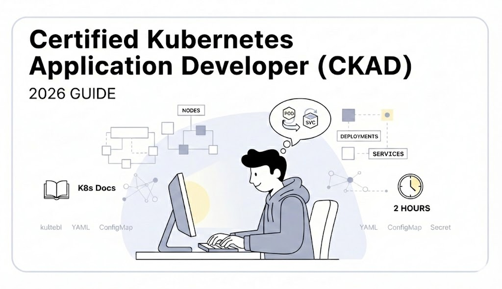

# **Certified Kubernetes Application Developer (CKAD) 2026 Guide**



The **Certified Kubernetes Application Developer (CKAD)** exam is a performance-based test requiring candidates to solve hands-on challenges in a live command-line environment. As of 2026, the exam is delivered via a proctored online environment by the Cloud Native Computing Foundation (CNCF).

---

### **1. Exam Overview**

| Feature           | Details                                                                    |
| ----------------- | -------------------------------------------------------------------------- |
| **Format**        | Performance-based (Hands-on CLI tasks)                                     |
| **Delivery**      | Online, proctored secure environment (PSI / Linux Foundation)              |
| **Duration**      | 2 Hours                                                                    |
| **Questions**     | ~15–20 tasks                                                               |
| **Passing Score** | CNCF does not publicly disclose exact cut score (commonly referenced ~66%) |
| **Price**         | **$445 USD (Base exam fee, includes one free retake)**                     |
| **Validity**      | ~2 Years (as per current CNCF candidate handbook cycle)                    |

---

### **2. Official Curriculum (2026)**

#### **Application Design and Build (20%)**

* Define, build, modify, and run container images (OCI-compliant).
* Use workload resources: Deployments, Jobs, CronJobs.
* Multi-container Pod patterns: Sidecar, Init, etc.
* Use persistent and ephemeral volumes.

#### **Application Deployment (20%)**

* Deploy applications using Kubernetes primitives.
* Understand rolling updates and rollbacks.
* Basic Helm and/or Kustomize usage (resources allowed; not mandatory in every exam).

#### **Application Observability & Maintenance (15%)**

* Liveness, readiness, and startup probes.
* Container logs and built-in monitoring commands.
* Debugging applications and pods.

#### **Application Environment, Configuration & Security (25%)**

* ConfigMaps and Secrets (usage & mounting).
* ServiceAccounts and RBAC basics.
* SecurityContexts and container security settings.
* Resource limits/requests and quotas.

#### **Services & Networking (20%)**

* Core service types: ClusterIP, NodePort, LoadBalancer.
* Ingress rules (hosts, paths, TLS).
* NetworkPolicies for traffic control.

---

### **3. The Exam Environment & Rules**

* **Secure Proctoring:** Delivered in an online secure environment (PSI Secure Browser / Linux Foundation portal).
* **CLI Interface:** You work within a remote terminal; no local tools allowed.
* **Open-Book Allowed:** Official Kubernetes docs (`kubernetes.io/docs/`), Helm docs (`helm.sh/docs`) available inside the environment.
* **Local Browser/Notes:** Not permitted; only use documentation available in the exam window.
* **Time Management:** Scripts and YAML can be created via `kubectl … --dry-run=client -o yaml`.
* **Resource Version:** Environment aligns with the current Kubernetes minor version used for CKAD updates.

---

### **4. Strategic Preparation Plan (2-Week High-Intensity Approach)**

#### **Week 1: Core Skills & Commands**

* Days 1–3: Master fundamental `kubectl` imperative commands and YAML generation.
* Days 4–7: Focus on Pods, Deployments, Services, ConfigMaps, Secrets, and probes.

#### **Week 2: Advanced Domains & Practice**

* Days 8–10: Deep dive into networking (Ingress, NetworkPolicies), RBAC, and resource limits.
* Days 11–14: Timed simulations with realistic exam scenarios to improve speed.

---

### **5. Essential 2026 Tips & Pro-Moves**

* **Exact Registration Info:** Ensure the name on your ID matches your CNCF registration exactly.
* **Namespace Defaults:**
  `kubectl config set-context --current --namespace=<namespace>`
  saves repeated typing.
* **Imperative + YAML Mix:** Generate YAML via `kubectl create … --dry-run=client -o yaml` where feasible to avoid typing errors.
* **Probes & Debugging:** Know readiness/liveness probes and basic debugging (`kubectl logs`, `kubectl exec`).
* **Documentation Search Habits:** Quickly search docs by resource type and field names, e.g., `kubernetes.io/docs/reference/generated/kubectl/kubectl-commands#…`.

---

### **6. Essential Command Snippets**

**Force Delete Pod (if needed):**

```
kubectl delete pod <name> --force --grace-period=0
```

**Generate Service YAML:**

```
kubectl expose deploy web --port=80 --target-port=8080 --type=NodePort --dry-run=client -o yaml > svc.yaml
```

**Temporary Debug Pod:**

```
kubectl run debug-pod --image=busybox -it --rm --restart=Never -- sh
```

**Namespace Context Set:**

```
kubectl config set-context --current --namespace=<ns>
```

---

### **7. Final Success Checklist**

1. [ ] **ID & Registration:** Government ID matches CNCF profile exactly.
2. [ ] **Training:** Strong practice with Kubernetes official docs and CLI.
3. [ ] **Practical Skills:** Hands-on experience with all five official domains.
4. [ ] **Mock Practice:** Aim to complete timed practice tests comfortably under 2 hours.

---

### **8. Official Resources & Links**

* CNCF CKAD Exam Page
* Candidate Handbook (in exam portal)
* Kubernetes Official Docs (`kubernetes.io/docs/`)
* Helm Documentation (`helm.sh/docs`) ([CNCF][1])

---

### **Happy Coding (and actual passing 😐)**

[1]: https://www.cncf.io/training/certification/ckad/ "Certified Kubernetes Application Developer (CKAD) | CNCF"
