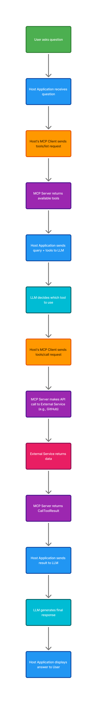

# 🔌 What is MCP?

**MCP (Model Context Protocol)** is a universal connector that helps AI applications access your data and tools.

Here's the situation: your AI assistant is intelligent, but it can't see your files, reach your databases, or interact with your apps—unless you create a bridge. That's exactly what MCP does. It's a single standard way to connect AI with all the different systems and information you use daily.

---

## ⚙️ How It Works

MCP brings together three simple parts:

- 🤖 **Your AI application** (like Claude or ChatGPT) - this is what you talk to
- 🖥️ **MCP servers** - these are small programs that link to your data sources (like Google Drive, GitHub, or files on your computer)
- 🔗 **MCP clients** - these sit inside your AI application and manage the connections

Once you set this up, your AI can read your documents, search your databases, and use your tools—all through these standard connections.

---

## 🖼️ An Example Flow

## ✨ What You Can Do

Here are real examples of what becomes possible:

- 📅 Your AI assistant can check your **Google Calendar and Notion** to help you stay organized
- 💻 AI coding tools can look at your **Figma designs** and build actual working websites
- 💼 Business chatbots can pull information from **multiple company databases** to answer questions
- 🎨 AI can even control creative tools like **Blender** to make 3D designs

---

## 🎯 Why This Matters

### 👤 If you use AI applications:

You get AI that understands your specific work and context, not just general knowledge. Your AI assistant can finally access your real documents and data to give you truly personalized help.

### 👨‍💻 If you build AI applications:

You save enormous amounts of time because you don't need to build custom connections to every single data source from scratch. There's a growing library of ready-to-use MCP servers you can add to your app right away.

---
 
## 🧱 The Three Core Building Blocks

MCP servers can share three types of things with AI applications:

| Building Block | Description |
|----------------|-------------|
| 📦 **Resources** | Your data and information (like file contents, database records, or API responses) |
| 💬 **Prompts** | Pre-made templates that help guide conversations with AI |
| 🔧 **Tools** | Actions the AI can take (like searching, creating files, or calling APIs) |

---

## 🚀 Getting Started

The beauty of MCP is that it's **open source** and growing rapidly. There are already **thousands of pre-built servers** you can use, and if you need something custom, building your own server is straightforward.

Whether you want to use existing servers or create new ones, MCP makes it simple to give AI applications the context they need to be truly helpful in your specific situation.
