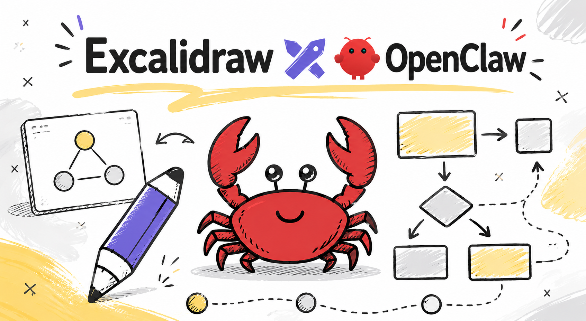

# Excalidraw MCP Setup with OpenClaw (WSL)

Get shareable, editable Excalidraw diagram links directly from OpenClaw — set up locally inside WSL.

## Prerequisites

- OpenClaw installed inside WSL
- `pnpm` available (`npm i -g pnpm` if not)
- `node` available

## **Install the Excaliclaw Skill**

Inside WSL, run:

```bash
openclaw skills install excaliclaw
```

This skill teaches OpenClaw how to generate valid Excalidraw scenes — handles fonts, text placement, arrows, and prevents empty diagram links.


## **Setup the Excalidraw MCP Server**

## Option 1 Remote Server:

```
https://mcp.excalidraw.com
```

## Option 2 Install Local:

```bash
cd ~/.openclaw/mcp

git clone https://github.com/excalidraw/excalidraw-mcp.git

cd excalidraw-mcp

pnpm install

pnpm run build
```

## Register It in OpenClaw Config

Open your OpenClaw config file and add the MCP server entry:

```json
"mcp": {
  "servers": {
    "excalidraw": {
      "command": "node",
      "args": [
        "/home/<your-wsl-username>/.openclaw/mcp/excalidraw-mcp/dist/index.js",
        "--stdio"
      ]
    }
  }
}
```

> Replace `<your-wsl-username>` with your actual WSL username (e.g. `danielhashmi`).

## Use It

Restart OpenClaw, then ask:

```
/excaliclaw Please generate a clear, well-structured, and logically organized diagram illustrating all OpenClaw context files, their internal relationships, and their respective interactions with the OpenClaw system.
```

OpenClaw returns a real Excalidraw link — fully editable, not a screenshot.

## Resources

- Excalidraw MCP repo — https://github.com/excalidraw/excalidraw-mcp
- Excaliclaw skill — https://clawhub.ai/nickytonline/excaliclaw

Good Luck ✨
