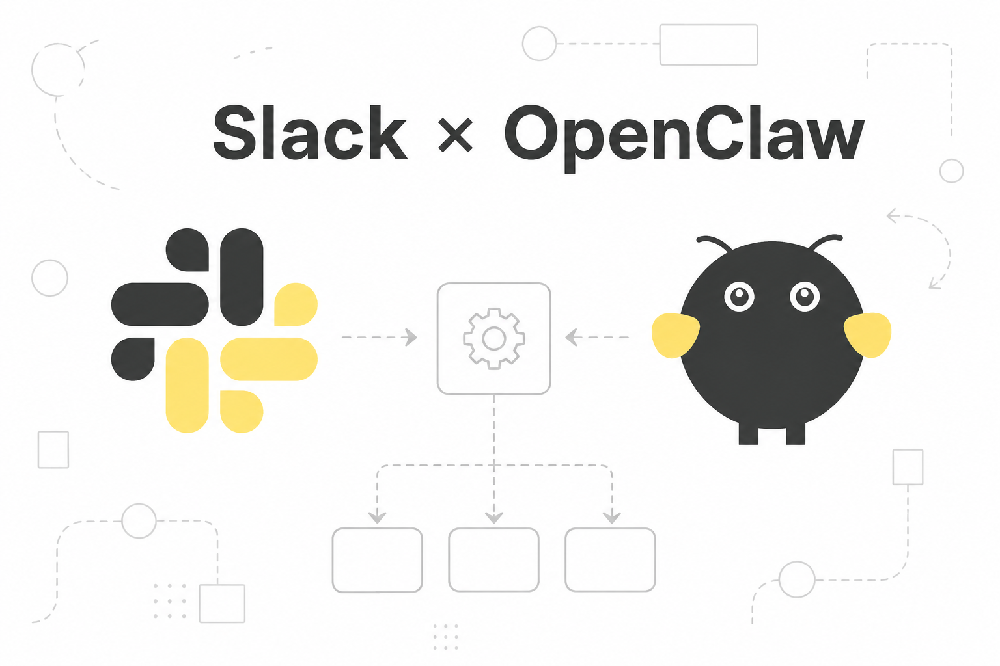

# OpenClaw — Slack Setup Guide

Socket Mode. DMs. Channels.

## 1. Install Slack and Create the Slack App

```bash
openclaw plugins install @openclaw/slack
```

Go to → **[api.slack.com/apps](https://api.slack.com/apps)** → **Create New App** → **From a manifest** → pick your workspace

Paste this manifest:

```json
{
  "display_information": {
    "name": "OpenClaw",
    "description": "Slack connector for OpenClaw"
  },
  "features": {
    "bot_user": {
      "display_name": "OpenClaw",
      "always_online": true
    },
    "app_home": {
      "home_tab_enabled": true,
      "messages_tab_enabled": true,
      "messages_tab_read_only_enabled": false
    },
    "assistant_view": {
      "assistant_description": "OpenClaw connects Slack assistant threads to OpenClaw agents.",
      "suggested_prompts": [
        {
          "title": "What can you do?",
          "message": "What can you help me with?"
        },
        {
          "title": "Summarize this channel",
          "message": "Summarize the recent activity in this channel."
        },
        {
          "title": "Draft a reply",
          "message": "Help me draft a reply."
        }
      ]
    },
    "slash_commands": [
      {
        "command": "/openclaw",
        "description": "Send a message to OpenClaw",
        "should_escape": false
      }
    ]
  },
  "oauth_config": {
    "scopes": {
      "bot": [
        "app_mentions:read",
        "assistant:write",
        "channels:history",
        "channels:read",
        "chat:write",
        "commands",
        "emoji:read",
        "files:read",
        "files:write",
        "groups:history",
        "groups:read",
        "im:history",
        "im:read",
        "im:write",
        "mpim:history",
        "mpim:read",
        "mpim:write",
        "pins:read",
        "pins:write",
        "reactions:read",
        "reactions:write",
        "usergroups:read",
        "users:read"
      ]
    }
  },
  "settings": {
    "socket_mode_enabled": true,
    "event_subscriptions": {
      "bot_events": [
        "app_home_opened",
        "app_mention",
        "assistant_thread_context_changed",
        "assistant_thread_started",
        "channel_rename",
        "member_joined_channel",
        "member_left_channel",
        "message.channels",
        "message.groups",
        "message.im",
        "message.mpim",
        "pin_added",
        "pin_removed",
        "reaction_added",
        "reaction_removed"
      ]
    }
  }
}
```

## 2. Get Your Tokens

After creating the app:

**App-Level Token (`xapp-...`)**
- Sidebar → **Basic Information** → scroll to **App-Level Tokens**
- Click **Generate Token and Scopes**
- Name it anything, add scope: `connections:write`
- Copy the token → starts with `xapp-`

**Bot Token (`xoxb-...`)**
- Sidebar → **OAuth & Permissions** → **Install to Workspace**
- After install → copy **Bot User OAuth Token**
- Starts with `xoxb-`

## 3. Configure OpenClaw

**Setup Config:**

```bash
export SLACK_APP_TOKEN=slack-app-token-example
export SLACK_BOT_TOKEN=slack-bot-token-example
cat > slack.socket.patch.json5 <<'JSON5'
{
channels: {
slack: {
enabled: true,
mode: "socket",
appToken: { source: "env", provider: "default", id: "SLACK_APP_TOKEN" },
botToken: { source: "env", provider: "default", id: "SLACK_BOT_TOKEN" },
},
},
}
JSON5
openclaw config patch --file ./slack.socket.patch.json5 --dry-run
openclaw config patch --file ./slack.socket.patch.json5
```

> Replace `slack-app-token-example` and `slack-bot-token-example` with the actual tokens.

## 4. Restart the Gateway

```bash
openclaw gateway restart
```

## What Works Now

**DMs** — By default, dmPolicy is set to `pairing`; you need to approve the pairing first. Run:

```bash
openclaw pairing approve slack <pairing_code>
```

**Channels** — Invite your bot into the channel, get the channel's ID: right-click the channel in Slack → **View channel details** → scroll to the bottom, copy the ID, and add it to your config:

```json
"slack": {
  "groupPolicy": "allowlist",
  "channels": {
    "<channel_id>": {
      "enabled": true,
      "requireMention": true
    }
  }
}
```

That was it! Good Luck ❣️
