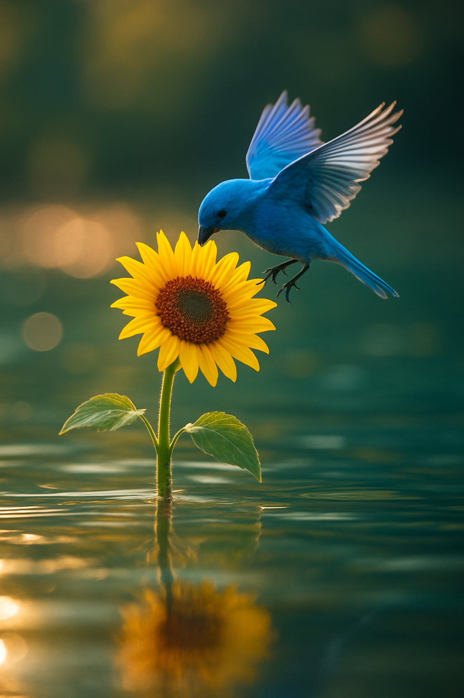
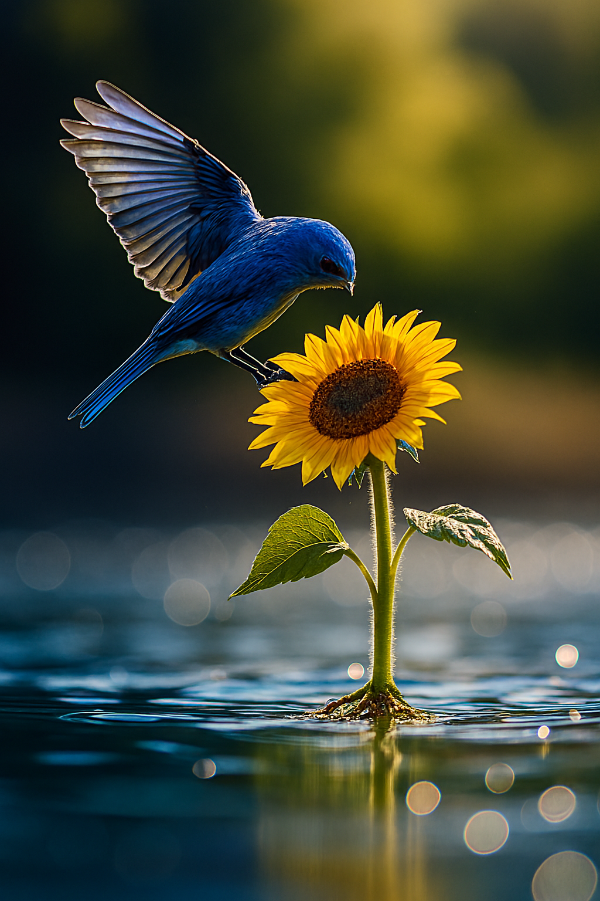
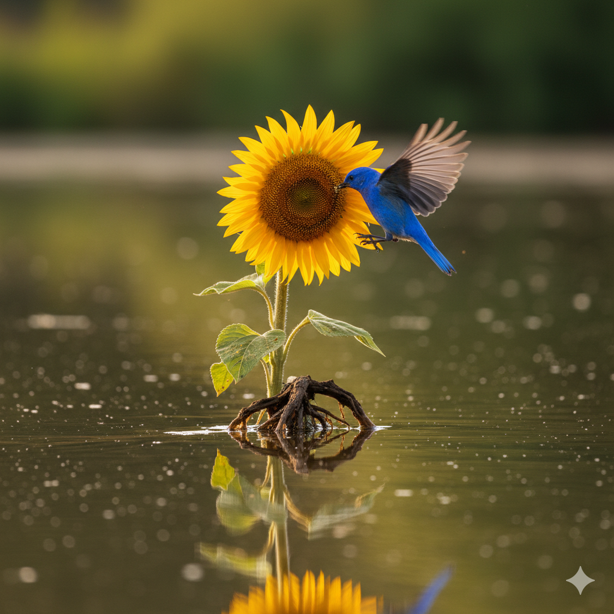

### A Bird Image

```
A blue bird hovering over a sunflower, gently pecking at the bloom. Side-view composition with the camera fully focused on both the bird and flower straight angle, using a shallow depth of field (f/1.8) to create a blurred background. The sunflower stands in a pristine, reflective lake with sunlight gleaming across the water's surface. The camera is positioned half-submerged, capturing both the submerged root system of the flower and the bird in flight above. Shot with a 135mm lens to create an enchanting, cinematic atmosphere with vibrant, eye-catching colors.
```

#### Generated Images from Different Models


*Generated with Google Imagen*


*Generated with ChatGPT/DALL-E*


*Generated with Microsoft Copilot*


*Generated with Nano Banana*
